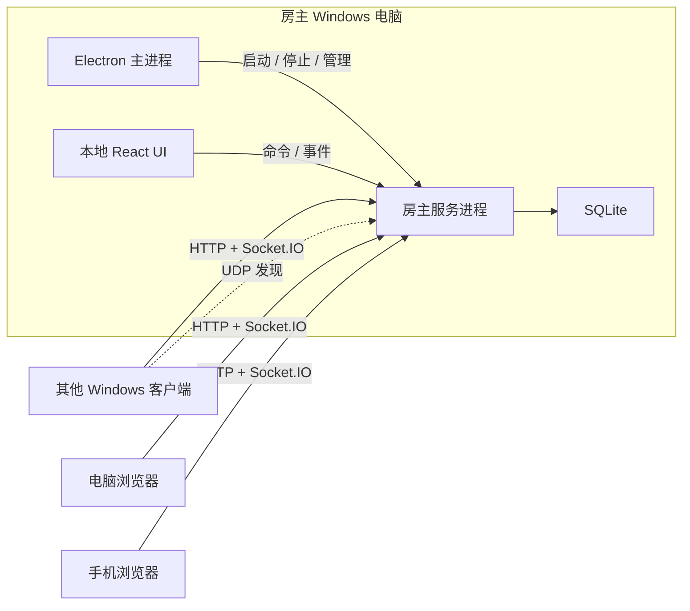

# Texas Hold'em 架构入口

> 本文是架构路由器，不是详细设计百科。产品行为以 `docs/product-specs/` 为准；不可违反的系统性质以 `INVARIANTS.md` 为准。

## 架构目标

- 房主电脑是唯一权威服务端，不依赖公网基础设施。
- Windows 客户端、电脑浏览器和手机浏览器共享同一套 React 游戏界面。
- `poker-core` 保持确定性、无 UI/网络/数据库依赖并可独立测试。
- 网络重试不产生重复下注、转账或结算；断线不删除玩家和对局数据。
- 每个边界都能被单独理解、实现和验证。

## 工作区边界

| 模块                     | 职责                                            |
| ------------------------ | ----------------------------------------------- |
| `packages/poker-core`    | 纯扑克规则、下注、底池、牌局和连续牌局状态机    |
| `packages/protocol`      | 网络与房间运行时 schema、命令、事件和快照       |
| `packages/lan-discovery` | UDP 发现协议和 Node 适配器，不依赖 Electron     |
| `packages/ui`            | 可复用响应式 UI 组件                            |
| `packages/test-support`  | 测试构造器和确定性夹具                          |
| `apps/host`              | 权威房间服务、实时接入、调度和 SQLite           |
| `apps/client`            | 浏览器和 Electron renderer 共用的 React 客户端  |
| `apps/desktop`           | Electron 主进程、IPC schema 和窄 preload bridge |

共享包不能导入 `apps/*`。领域模块不能导入 Electron、Fastify、Socket.IO、React 或 SQLite。

## 运行时拓扑

## 架构决策摘要

- 服务端执行发牌、洗牌、行动计时、下注校验、底池构造、牌型比较和结算；客户端只提交意图并投影权威快照。
- Electron renderer 使用 sandbox、context isolation 和 `nodeIntegration=false`；桌面能力只能通过窄化 preload API 暴露。
- Electron 不加载外部远程 HTML，外部 HTTP(S) 交给系统浏览器打开。
- 运行中的房间以内存权威状态为准，事件和关键快照持久化到房主本机 SQLite。
- 房主服务以独立 Node 进程运行，管理模式不监听 LAN；只有真实创建或恢复房间时才启动完整服务。
- 桌面和浏览器品牌资源从同一来源生成并由构建检查。

## 详细设计入口

- 扑克原语和局部规则：[`docs/design-docs/poker-domain.md`](docs/design-docs/poker-domain.md)
- 牌局编排和状态转换：[`docs/design-docs/hand-lifecycle.md`](docs/design-docs/hand-lifecycle.md)
- 房间领域：[`docs/design-docs/room-domain.md`](docs/design-docs/room-domain.md)
- 协议与同步：[`docs/design-docs/protocol-and-sync.md`](docs/design-docs/protocol-and-sync.md)
- 网络发现：[`docs/design-docs/network-and-discovery.md`](docs/design-docs/network-and-discovery.md)
- 持久化与恢复：[`docs/design-docs/persistence-and-recovery.md`](docs/design-docs/persistence-and-recovery.md)
- 客户端：[`docs/design-docs/client.md`](docs/design-docs/client.md)
- Electron：[`docs/design-docs/desktop.md`](docs/design-docs/desktop.md)

## 验证入口

统一质量命令由根 `package.json` 提供。架构不变量和证据入口见 `INVARIANTS.md`、`docs/exec-plans/` 及现有 `docs/verification/`。
