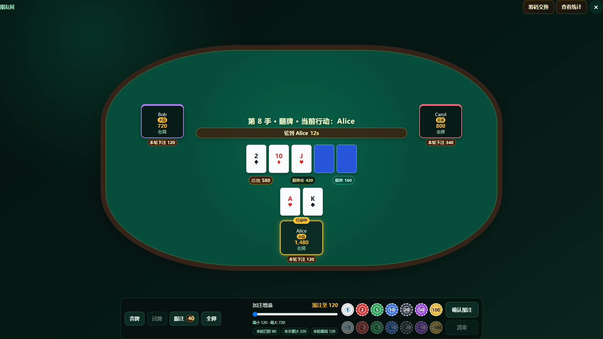
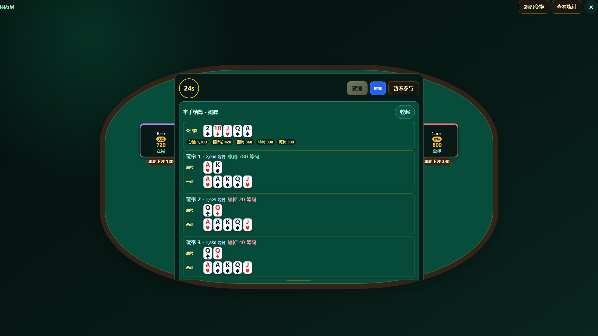
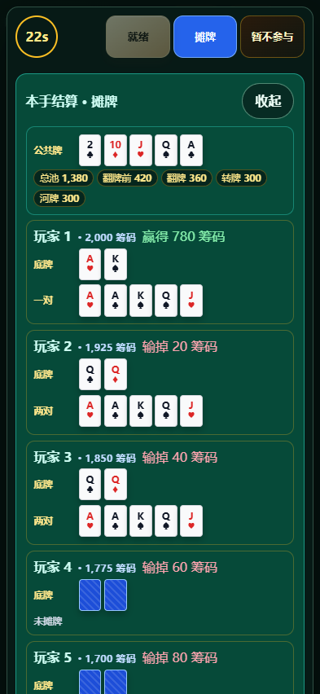

# Texas Holdem

> 面向朋友局的本地优先局域网德州扑克。

[](https://github.com/LeonemZhang/Texas_Holdem/actions/workflows/quality.yml)
[](https://github.com/LeonemZhang/Texas_Holdem/releases/latest)

[](./LICENSE)

Texas Holdem 是一款供朋友通过实体局域网或虚拟局域网游玩的无限注德州扑克游戏。房主使用 Windows 客户端运行权威房间服务，其他玩家可以使用 Windows 客户端，或直接通过手机、电脑浏览器加入。

**English summary:** Texas Holdem is a local-first no-limit Hold'em game for friends. A Windows host runs the authoritative room service, while other players join from Windows or a browser over a physical LAN or a virtual LAN such as EasyTier. The project does not operate public matchmaking, accounts, payments, or real-money features.

## 界面预览

<table>
  <tr>
    <td align="center"><strong>桌面端牌局</strong></td>
    <td align="center"><strong>桌面端结算</strong></td>
  </tr>
  <tr>
    <td></td>
    <td></td>
  </tr>
  <tr>
    <td align="center"><strong>手机端牌局</strong></td>
    <td align="center"><strong>手机端结算</strong></td>
  </tr>
  <tr>
    <td align="center"></td>
    <td align="center"></td>
  </tr>
</table>

## 核心功能

- 2–10 人标准无限注德州扑克，支持完整行动、全押和服务端计时。
- 支持房间管理、座位排序和踢出玩家。
- Windows 客户端支持建房、局域网扫描和 IP 直连。
- 手机或电脑浏览器可通过链接、二维码直接加入。
- 桌面与手机共享响应式牌桌，可完成完整对局。
- 基于本地对局记录的游戏恢复、断线重连。
- 支持指定筹码请求、公开记录、统计和局内称号。
- 服务端权威执行发牌、结算和牌面隔离，并支持对局恢复。

## 下载

前往 [GitHub Releases](https://github.com/LeonemZhang/Texas_Holdem/releases/latest) 下载 Windows 10/11 x64 版本：

| 产物                          | 用途                                                           |
| ----------------------------- | -------------------------------------------------------------- |
| `Texas Holdem-<版本>-x64.msi` | 推荐的安装方式；后续可使用更高版本 MSI 就地升级现有安装。      |
| `Texas Holdem-<版本>-x64.zip` | 免安装便携版；解压后运行 `Texas Holdem.exe`，不参与 MSI 升级。 |

当前发布产物未进行代码签名，Windows 可能显示 SmartScreen 或未知发布者提示。请只从本仓库的 Releases 页面下载，并使用对应 Release 中公布的 SHA-256 校验文件完整性。

桌面客户端最低支持原生 1920×1080 显示器、Windows 100% 显示缩放和普通最大化窗口。更低分辨率、低高度还原窗口或更高显示缩放仍可运行，但只作尽力兼容，牌桌可能需要纵向滚动。

## 快速开始

### 房主创建牌桌

1. 在 Windows 10/11 x64 电脑上安装或解压客户端。
2. 启动 Texas Holdem，选择朋友能够访问的实体网卡或虚拟局域网网卡。
3. 设置房间名称、昵称、筹码、盲注和行动时间后创建房间。
4. 首次启动房主服务时，允许 Windows 防火墙的**专用网络**访问。
5. 将客户端显示的连接地址或二维码发送给其他玩家。

房主必须使用 Windows 客户端并参与游戏；浏览器不能创建房间或管理本机对局记录。

### 玩家加入牌桌

- **Windows 客户端：**刷新局域网房间列表，或输入房主 IP/完整连接地址。
- **电脑或手机浏览器：**打开房主分享的地址或扫描二维码，检测连接后输入昵称加入。
- 所有参赛玩家准备完成、且房间内至少有 2 人时，由房主开始第一手牌。

如果输入的是裸 IP，客户端默认使用 `32100` 端口。广播扫描失败并不代表房间不可连接，请优先尝试房主 IP 直连。

## 使用 EasyTier 异地联机

[EasyTier](https://github.com/EasyTier/EasyTier) 是第三方虚拟局域网工具。它可以让位于不同公网环境、甚至没有公网 IP 的设备加入同一虚拟网络；节点会尝试 NAT 穿透，无法建立 P2P 连接时可通过共享节点中继。Texas Holdem 只把 EasyTier 当作独立的网络通道，不集成或重新分发 EasyTier，也不与 EasyTier 项目存在隶属或官方合作关系。

开始前请阅读 EasyTier 的[官方下载页](https://easytier.cn/guide/download.html)和[快速组网指南](https://easytier.cn/guide/network/quick-networking.html)。

1. 所有参与设备安装 EasyTier，并加入同一个虚拟网络。
2. 所有玩家使用相同的共享节点配置、唯一的网络名称和足够强的网络密钥；不要使用示例中的简单名称或密码。
3. 在 EasyTier 中确认各节点在线，并确认玩家能够访问房主的 EasyTier 虚拟 IP。
4. 房主创建 Texas Holdem 房间时，选择带有该虚拟 IP 的 EasyTier 网卡。
5. Windows 玩家在客户端输入房主虚拟 IP；浏览器玩家打开：

   ```text
   http://<房主的 EasyTier 虚拟 IP>:32100
   ```

6. 如果无法加入，依次检查 EasyTier 网络名和密钥、共享节点、房主所选网卡，以及 Windows 防火墙的专用网络规则。

### EasyTier 下的房间扫描

EasyTier 虚拟 IP 直连是推荐方式，不要求虚拟网络转发 UDP 广播。EasyTier 的 Windows UDP 广播中继属于可选增强；如果希望在虚拟网络中使用“扫描牌桌”，请根据 [EasyTier 当前版本说明](https://github.com/EasyTier/EasyTier/releases)启用 UDP 广播中继，并确保 `32101/UDP` 未被防火墙阻止。即使广播中继不可用，IP 直连仍应正常工作。

共享节点的负载和线路质量会影响延迟与稳定性。需要更高可控性时，可以按照 EasyTier 官方文档自建共享节点。

## 网络端口与安全边界

| 端口        | 用途                                       | 是否必需                  |
| ----------- | ------------------------------------------ | ------------------------- |
| `32100/TCP` | 浏览器页面、HTTP 接口和 Socket.IO 实时通信 | 加入和游玩必需            |
| `32101/UDP` | Windows 客户端房间发现                     | 仅扫描需要；IP 直连不依赖 |

- 本项目面向受信任的实体局域网或虚拟局域网，不建议将游戏端口直接映射到公网。
- Texas Holdem 应用层当前使用 HTTP/Socket.IO，不自行提供 TLS 或端到端加密。
- 使用 EasyTier 时，网络传输保护取决于 EasyTier 的实际组网和安全配置；需要更强保护时请阅读其[安全模式说明](https://easytier.cn/guide/network/secure-mode.html)。
- 即使虚拟网络已加密，也只应把牌桌地址、虚拟网络名称和密钥分享给可信玩家。

### 常见联机问题

| 现象                       | 建议检查                                                              |
| -------------------------- | --------------------------------------------------------------------- |
| 扫描不到房间               | 确认处于同一实体/虚拟网络；改用房主 IP 直连。                         |
| IP 直连失败                | 检查房主选择的网卡、`32100/TCP`、专用网络防火墙规则和虚拟 IP 连通性。 |
| EasyTier 节点互相不可见    | 检查网络名、网络密钥和共享节点配置是否一致。                          |
| 浏览器能打开但无法恢复身份 | 使用原设备和原浏览器数据；不要只凭相同昵称尝试恢复。                  |
| 房主异常退出               | 在原房主电脑的对局记录中恢复异常中断的房间。                          |

## 数据与隐私

- 房间、事件、快照、玩家和统计数据保存在房主电脑的本地 SQLite 数据库中。
- 玩家首次加入后获得按房间隔离的重连身份；昵称只用于显示，不是身份凭证。
- 房主服务为每名玩家生成独立快照，不会先向所有客户端广播完整底牌再由界面隐藏。
- 房主界面与普通玩家遵守相同的底牌隔离规则；房主不能通过正常 UI 查看牌组或其他玩家的隐藏底牌。
- 删除已归档对局会同时删除其事件、快照、玩家和统计数据，且不可恢复。

## 产品边界

本项目不提供：

- 公网大厅或公网匹配。
- 账号、排位、商城、真实支付或商业化系统。
- 语音聊天。
- 跨设备房主迁移。
- 第一手开始后的新玩家加入；已存在的玩家仍可断线重连。
- 防恶意房主的分布式洗牌。

## 本地开发

### 环境要求

- Windows、macOS 或 Linux 开发环境。
- Node.js `24.14.0`；根目录同时约束兼容范围为 `>=22.12.0 <25`。
- pnpm `10.0.0`。

### 安装与启动

```powershell
git clone https://github.com/LeonemZhang/Texas_Holdem.git
Set-Location Texas_Holdem
pnpm install --frozen-lockfile
pnpm dev
```

`pnpm dev` 会构建共享包和房主/客户端依赖，然后启动 Vite 客户端与 Electron 桌面端。

### 质量检查

```powershell
pnpm format:check
pnpm lint
pnpm typecheck
pnpm test
pnpm build
pnpm test:e2e
```

### Windows 打包

```powershell
pnpm version:check
pnpm package:win
```

正式产物写入 `release/artifacts/`。版本同步与打包规则见[发布文档](./docs/release.md)。

## 项目架构

| 模块                     | 职责                                                              |
| ------------------------ | ----------------------------------------------------------------- |
| `apps/desktop`           | Electron 主进程、受限 preload、网卡选择、宿主进程与本地记录管理。 |
| `apps/client`            | Windows 渲染器与浏览器共用的 React 客户端。                       |
| `apps/host`              | 权威房间服务、实时通信、调度和 SQLite 持久化。                    |
| `packages/poker-core`    | 不依赖网络、数据库或 UI 的确定性扑克规则。                        |
| `packages/protocol`      | 运行时 schema 和传输类型。                                        |
| `packages/lan-discovery` | UDP 房间发现协议和 Node 适配器。                                  |
| `packages/ui`            | 可复用的响应式 React 组件。                                       |
| `packages/test-support`  | 测试构建器与确定性夹具。                                          |

房主 Windows 客户端启动独立房主服务进程；Windows 客户端、电脑浏览器和手机浏览器都通过 HTTP 与 Socket.IO 连接同一个权威服务。更完整的边界和数据流见[架构文档](./docs/architecture.md)。

## 项目文档

- [产品规则与明确边界](./docs/product-spec.md)
- [系统架构与模块职责](./docs/architecture.md)
- [Windows 打包与版本管理](./docs/release.md)
- [Luna 增量开发计划](./docs/plans/luna-incremental-plan.md)
- [最终 Windows 与联机验收记录](./docs/verification/e2e10-final-smoke.md)

产品和架构文档是行为修改的事实来源；实现计划与它们冲突时，以产品和架构文档为准。

## 贡献

欢迎提交 Issue 和 Pull Request。开始行为修改前，请先阅读产品规格和架构文档，并遵守以下原则：

- 不弱化类型、运行时 schema、lint 规则或测试来让改动通过。
- 扑克核心逻辑保持纯净、确定性，不依赖网络、数据库、UI、系统时钟或全局随机数。
- 客户端不自行计算赢家、底池、牌型或牌面公开范围，只渲染服务端权威快照。
- 提交前至少运行相关模块测试、根目录 `pnpm typecheck` 和 `pnpm lint`。

安全漏洞请不要直接公开完整利用细节；报告方式见[安全策略](./SECURITY.md)。

## 许可证

本项目以 [GNU General Public License v3.0 only](./LICENSE) 发布。第三方项目和依赖仍分别遵循其自身许可证，已使用的外部素材见[第三方声明](./THIRD_PARTY_NOTICES.md)。
