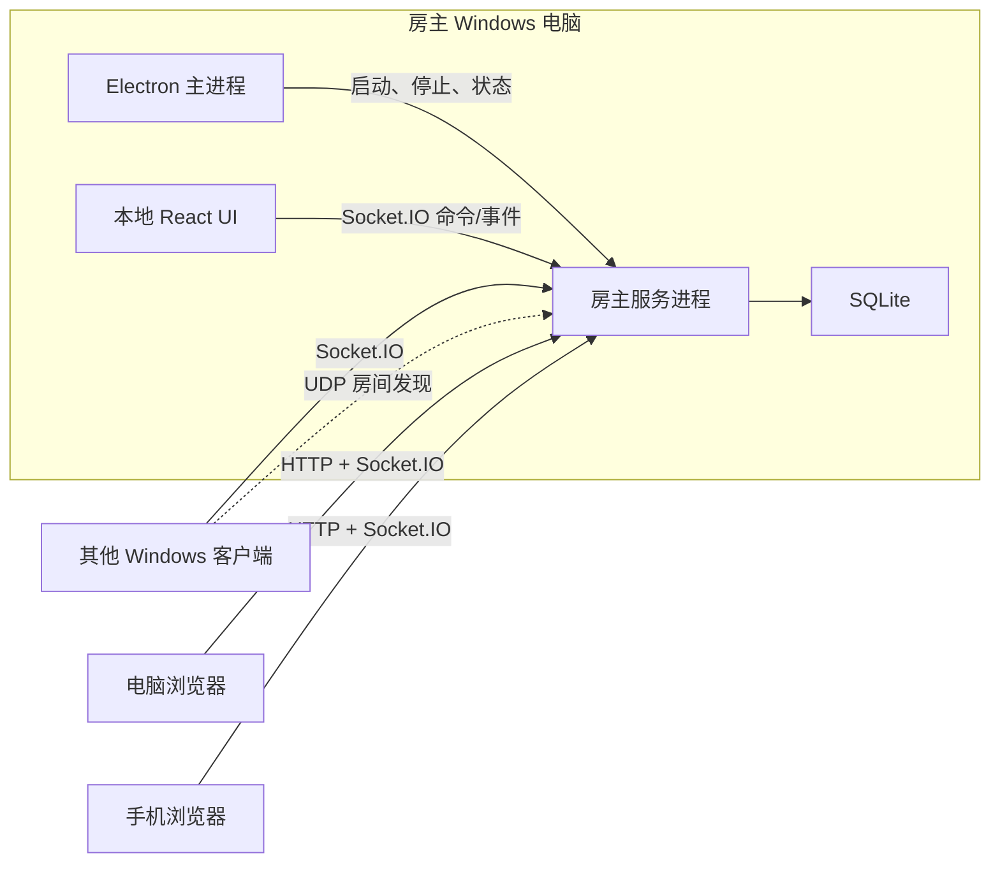

# Texas Hold'em 项目架构

> 状态：开发基线  
> 适用范围：`LeonemZhang/Texas_Holdem`  
> 产品规则以 `docs/product-spec.md` 为准。本文定义系统边界、技术决策、模块职责和后续实施约束。

## 1. 架构目标

- 无公网基础设施也能完成多人联机。
- 房主电脑是唯一权威服务端。
- Windows 客户端和网页端复用同一套 React 游戏界面。
- 手机浏览器是一等参与端，不是只读或降级端。
- 游戏核心保持确定性、无界面依赖并可独立测试。
- 网络重试不会导致重复下注、重复转账或重复结算。
- 意外断线不会删除房间和玩家状态。
- 代码边界适合按最小模块逐步实现和验证。

## 2. 核心架构决策

### 2.1 权威房主服务器

系统采用客户端/服务器架构，不采用点对点同步：

- 房主 Windows 客户端启动本地房间服务器。
- 所有发牌、洗牌、行动计时、下注校验、底池构造、牌型比较和结算均在服务端执行。
- 客户端只提交命令并显示服务端确认后的状态。
- 房主 UI 也只是一个客户端，不能绕过服务端直接改写游戏状态。

本项目接受“房主电脑本身受信任”这一边界，不实现对恶意房主的密码学防作弊。

### 2.2 共用 Web UI

Windows 客户端和浏览器使用同一套 React 应用：

- Electron 加载打包在应用内的前端资源。
- 房主服务器同时向浏览器提供同一版本的前端静态资源。
- 前端通过运行时适配器判断是否拥有桌面能力。
- 只有桌面适配器可以创建房间、扫描局域网和显示原生关闭确认。
- 游戏组件和状态管理不感知 Electron API。

### 2.3 桌面安全边界

- Electron 渲染进程启用沙箱和上下文隔离。
- 禁止在渲染进程启用 Node.js 集成。
- 只通过窄化、参数校验后的 preload API 暴露桌面能力。
- Electron 不加载房主或其他玩家提供的远程 HTML；桌面端始终加载本地打包 UI。
- 网络消息作为不可信输入进行协议校验。

### 2.4 本地优先持久化

- 正在运行的房间状态以内存中的权威状态为准。
- 接受的命令产生顺序事件，并持久化到房主本机 SQLite。
- 在关键状态转换和每手结算后保存快照。
- 每个房间都是独立的对局记录，并保存最近一次联机网卡名称和公布 IPv4；桌面端启动后显示大厅、不自动将“最近一局”恢复到运行时。仅当检测到本机仍在运行的房主服务时，大厅才在加入表单上方展示其`进行中`记录的恢复入口，并重新取得该房间的房主会话。
- 恢复时仅在保存的 IPv4 仍属于本机网卡时自动复用；否则要求房主选择网卡，成功恢复后覆盖记录的网卡信息。迁移前的记录允许没有网卡信息。
- 网卡选择只存在于当前创建或恢复操作的渲染状态；桌面主进程不得把未创建房间的选择保存为全局宿主配置。旧记录和失效地址由渲染进程先展示选择控件，再调用恢复 IPC，避免以 IPC 拒绝作为正常交互分支。
- 项目不依赖云数据库或公网同步。

## 3. 技术栈

| 层             | 选择                | 说明                                               |
| -------------- | ------------------- | -------------------------------------------------- |
| 语言           | TypeScript 严格模式 | 前后端共享协议类型，减少多语言边界                 |
| 工作区         | pnpm workspace      | 管理应用与共享包                                   |
| 桌面端         | Electron            | 提供 Windows 窗口、UDP、原生退出确认和服务进程管理 |
| 前端           | React + Vite        | 同一构建产物服务桌面端和浏览器端                   |
| 房主 HTTP 服务 | Fastify             | 提供静态资源、健康检查、加入握手和必要的 REST 接口 |
| 实时通信       | Socket.IO           | 提供有序消息、确认、重连和房间广播能力             |
| 协议校验       | Zod                 | 在客户端、IPC 和服务端边界执行运行时校验           |
| 数据库         | SQLite              | 保存房间、快照、事件、玩家和统计数据               |
| 单元/集成测试  | Vitest              | 测试纯规则模块和服务端模块                         |
| 端到端测试     | Playwright          | 验证多浏览器玩家、响应式界面和重连流程             |

具体依赖版本在创建工程骨架时锁定，不在架构文档中使用浮动的 `latest`。

## 4. 运行时拓扑



### 4.1 Electron 主进程

负责：

- 创建和管理窗口。
- 提供受限的桌面 IPC。
- 枚举网络适配器。
- 发送 UDP 房间发现请求。
- 创建房间时启动独立房主服务进程。
- 执行原生关闭确认和正常退出流程。
- 仅通过受限 preload 通道复制邀请码二维码 PNG；浏览器优先使用 Clipboard API，桌面端不得向渲染进程暴露通用剪贴板能力。
- 通过窄化 IPC 提供本机对局记录的列出、创建、恢复、归档、删除和查看入口；不向渲染进程暴露 SQLite、服务进程句柄或通用 IPC。
- 对局记录管理使用仅本机 IPC 的宿主进程模式：它打开持久化和管理端口，但不监听 HTTP、不启动 Socket.IO 或 UDP 发现，也不公布局域网地址。
- 主窗口只保留受信任的本地渲染器地址；外部 HTTP(S) 链接交给系统浏览器打开，所有新窗口请求一律拒绝。
- 默认隐藏应用菜单，避免将开发者工具或未受限的原生入口暴露给普通玩家。

主进程不实现德州扑克规则。

### 4.2 房主服务进程

房主服务以独立 Node.js 进程运行，避免 UI 或渲染进程异常直接污染游戏状态。

负责：

- HTTP 服务和浏览器静态资源。
- Socket.IO 连接与身份恢复。
- UDP 房间发现响应。
- 房间、牌局和筹码转移命令处理。
- 游戏状态机和服务端计时。
- SQLite 持久化。
- 面向不同玩家过滤私有信息。
- 提供仅供 Electron 主进程调用的对局记录管理端口；该端口不经 LAN HTTP 或 Socket.IO 暴露给玩家。
- 管理模式不创建网络服务；只有创建或恢复实际房间时才以选定或已保存的网卡启动完整宿主服务。
- 启动成功后向 Electron 主进程发送带实例标识的就绪信号；由桌面端启动的服务持续检测父进程，父进程消失时执行异常关闭，不能伪造正常 `CLOSED` 事件。

### 4.3 React 客户端

负责：

- 显示服务端状态快照和事件结果。
- 根据服务端提供的合法行动渲染操作按钮。
- 收集玩家意图并提交命令。
- 展示连接、掉线和恢复状态。
- 适配桌面及最低 360px 宽度的手机界面。
- 只从相邻的权威快照推导界面音效；首次快照、重复快照和回放快照不得重播历史操作。

客户端不自行判定赢家、底池或各街下注历史，也不自行推进牌局阶段；这些展示数据均来自服务端权威快照。

## 5. 建议仓库结构

逻辑模块不等于独立 npm 包。只有跨运行时复用或具备明确部署边界时才创建 workspace 包，避免过度拆包。

```text
Texas_Holdem/
├─ apps/
│  ├─ client/                 # 共用 React 客户端
│  ├─ desktop/                # Electron 主进程与 preload
│  └─ host/                   # 房主 HTTP、Socket.IO 与进程入口
├─ packages/
│  ├─ poker-core/             # 纯德州扑克规则与状态机
│  ├─ protocol/               # 命令、事件、快照和 IPC schema
│  ├─ lan-discovery/          # Node/Electron UDP 发现协议
│  ├─ ui/                     # 可复用响应式 UI 组件
│  └─ test-support/           # 牌组、玩家和对局测试构造器
├─ docs/
│  ├─ product-spec.md
│  └─ architecture.md
├─ package.json
├─ pnpm-workspace.yaml
└─ tsconfig.base.json
```

## 6. 最小逻辑模块边界

后续详细实施计划应以这里的逻辑模块为拆分上限，并在需要时进一步细分。

### 6.1 `poker-core`

`poker-core` 是无网络、无数据库、无系统时间读取的纯 TypeScript 包。

内部逻辑模块按依赖顺序为：

1. **牌与牌组**：点数、花色、牌编码、52 张唯一牌和洗牌输入输出。
2. **五张牌比较**：牌型分类及同牌型比较键。
3. **七张牌比较**：枚举 21 种五张组合并选择最大结果。
4. **座位与位置**：有效座位、庄家、大小盲及双人特殊规则。
5. **下注轮状态**：当前下注、跟注额、最小加注和行动资格。
6. **底池构造**：主池、边池、贡献额和获奖资格。
7. **底池分配**：赢家、平分和奇数筹码。
8. **单手状态机**：翻牌前、翻牌、转牌、河牌和结算阶段推进。
9. **连续牌局状态**：庄家轮转、完成手数和盲注增长。

每个模块只能依赖其前置模块，不允许反向依赖 UI、协议、Socket.IO 或 SQLite。

### 6.2 房间领域模块

房间领域位于 `apps/host` 的独立目录中，负责游戏核心之外的多人房间规则：

1. 房间设置与验证。
2. 加入、座位和身份令牌。
3. 第一手前的房间准备。
4. 每手前的 30 秒手牌准备。
5. 筹码请求、给予、批准、拒绝和撤销。
6. 主动退出、房主分阶段移出、意外掉线和重连。
7. 房主暂停、继续和关闭房间。
8. 统计事件归约和局内称号。

房间领域通过明确接口调用 `poker-core`，不能直接修改其内部状态。

### 6.3 协议模块

`packages/protocol` 定义：

- 客户端命令。
- 服务端事件。
- 玩家可见快照。
- 房间发现报文。
- Electron IPC 请求与响应。
- 协议版本和兼容性规则。

协议 schema 是运行时边界。TypeScript 类型必须从 schema 推导，不能另外维护一份可能漂移的手写类型。

### 6.4 客户端模块

客户端按交互职责拆分：

1. 连接与重连。
2. 联机大厅。
3. 创建房间。
4. 房间等待和首局准备。
5. 牌桌展示。
6. 玩家行动控件。
7. 手牌准备与筹码交换。
8. 统计与对局结算。
9. 房主控制。
10. 桌面能力适配器与浏览器能力适配器。

每个功能先完成窄屏与桌面布局定义，再接入真实服务端数据。

## 7. 牌型比较算法

### 7.1 运行时实现

运行时使用可审计的确定性算法：

1. 从 7 张牌枚举全部 21 个五张牌组合。
2. 将每个五张组合转换为比较元组。
3. 按牌型等级和逐级踢脚牌比较元组。
4. 返回最大元组、牌型名称和组成最佳牌型的五张牌。

五张牌比较元组示例：

```text
同花顺 [8, 顺子最高点]
四条   [7, 四条点数, 踢脚牌]
葫芦   [6, 三条点数, 对子点数]
同花   [5, 第1高牌, 第2高牌, 第3高牌, 第4高牌, 第5高牌]
顺子   [4, 顺子最高点]
三条   [3, 三条点数, 第1踢脚, 第2踢脚]
两对   [2, 大对子, 小对子, 踢脚牌]
一对   [1, 对子点数, 第1踢脚, 第2踢脚, 第3踢脚]
高牌   [0, 第1高牌, 第2高牌, 第3高牌, 第4高牌, 第5高牌]
```

A2345 顺子的最高点按 5 处理。

### 7.2 成熟实现交叉验证

核心实现不依赖外部库完成运行时判定，但测试必须使用成熟 evaluator 作为独立参考，例如 PH Evaluator 或经过审查的 TypeScript 实现。

验证层次：

- 穷举全部 2,598,960 个五张牌组合并核对标准牌型数量。
- 使用固定种子生成大量七张牌，与参考 evaluator 比较强弱及平局结果。
- 为所有牌型、踢脚牌、公共牌成牌和 A2345 编写具名用例。
- 在引入或升级参考库时记录版本和许可证。

## 8. 游戏状态与命令模型

### 8.1 状态阶段

```text
LOBBY
PRE_HAND_READY
PREFLOP
FLOP
TURN
RIVER
SHOWDOWN
SETTLEMENT
PAUSED
CLOSED
```

`LOBBY` 中房主默认已准备；所有非房主玩家准备后只启用房主开始命令，不自动转换到 `PRE_HAND_READY` 或 `PREFLOP`。

第一手由房主开始命令直接创建手牌。后续每手必须先经过 `PRE_HAND_READY`。

准备截止时服务端将未确认玩家投影为 `sitting-out`，但不销毁仍处于 `PRE_HAND_READY` 的准备上下文或待处理筹码请求；不足两名就绪时不创建新手牌。后续沿用既有 `hand-ready.set-choice: ready` 命令接受有资格玩家重新就绪，达到两人即由同一状态机创建下一手。

### 8.2 命令

每个修改状态的客户端请求必须包含：

- `commandId`：客户端生成的唯一标识，用于幂等去重。
- `roomId`。
- `playerId` 和会话身份。
- `expectedVersion`：客户端认为的房间状态版本。
- 命令类型和通过 schema 校验的载荷。

示例命令：

- `SetLobbyReady`
- `StartFirstHand`
- `Fold`
- `Check`
- `Call`
- `RaiseTo`
- `AllIn`
- `RequestChips`
- `GrantChips`
- `ApproveChipRequest`
- `SetPreHandReady`
- `ShowHoleCards`
- `LeaveRoom`
- `CloseRoom`

### 8.3 事件与快照

- 服务端接受命令后产生一个或多个顺序事件。
- 每个事件包含单调递增的 `sequence`。
- 每次状态变化增加 `stateVersion`。
- 客户端不能依赖 Socket.IO 默认重试来保证业务幂等。
- 短时重连优先补发缺失事件。
- 无法连续补发时发送该玩家专属的完整快照。
- 快照必须过滤其他玩家底牌、牌组顺序和未公开信息；牌桌展示所需的总池、各街投入、结算净变化和最佳五张牌均由服务端投影。仅在服务端确认的摊牌结算后，可向所有玩家公开仍有资格竞争底池者的两张底牌。因弃牌提前结束时，快照保留已公开的公共牌但不补发后续牌；若无人可继续行动，服务端补齐公共牌至河牌后再结算。结算到下一手开始的窗口内，玩家只能通过服务端校验的“主动摊牌”命令公开本人的两张底牌；该公开结果写入公共结算快照、不可撤销，且不改变结算。

## 9. 局域网发现

### 9.1 默认端口

- HTTP 与 Socket.IO：`32100/TCP`。
- 房间发现：`32101/UDP`。
- 端口允许在后续配置中覆盖，但协议报文必须携带实际端口。

### 9.2 发现流程

1. Windows 客户端枚举实体和虚拟 IPv4 网卡。
2. 点击刷新后向候选网卡的广播地址发送带协议版本的发现请求。
3. 房主以单播响应房间摘要和连接地址。
4. 客户端合并重复响应，并按最后响应时间移除过期房间。
5. 客户端使用 TCP 健康检查验证房间确实可连接。

房主服务监听 `0.0.0.0`，但房间发现响应只公布房主选择的网卡地址，例如 `10.126.126.1`。

广播发现是便利功能，手动 IP 直连是必须始终可用的兜底能力。

## 10. 身份与信息隔离

- 玩家首次加入后获得不可猜测的重连令牌。
- 服务端根据令牌恢复 `playerId` 和座位，不能使用昵称作为身份凭证。
- 昵称在同一房间的玩家身份记录中唯一，但只用于显示；主动退出的历史昵称不构成恢复凭证。
- 主动退出后，原设备保存的令牌可恢复同一 `playerId`、座位、筹码和统计；恢复令牌按 `roomId` 隔离，因此同一设备可保留多个房间的独立恢复资格。
- 第一手前被房主移出使用可恢复的 `left` 状态；第一手后被移出使用终止状态 `removed`，权威快照保留座位与历史，但会话认证、命令授权和恢复接口必须拒绝该身份。
- 可选房间密码只用于限制加入，不代替重连令牌。
- 服务端为每名玩家生成独立快照，不能把全量状态广播后让客户端自行隐藏底牌。
- 房主 UI 和普通玩家 UI 接收相同级别的牌面隔离；房主只能通过受信任的服务进程控制房间，不能从 UI 查看牌组。

## 11. 持久化模型

建议持久化以下概念实体：

- `rooms`：一条房间即一条对局记录，保存房间设置、房主、创建/最后活动时间、正常关闭标记与记录生命周期状态。
- `players`：稳定身份、昵称、座位、筹码和连接状态。
- `events`：房间内按 sequence 排序的领域事件。
- `snapshots`：可恢复的房间状态和对应 sequence。
- `hand_summaries`：每手参与者、公共牌、底池和结果。
- `chip_transfers`：请求、批准、拒绝、撤销和最终转移。
- `statistics`：可由事件重建的缓存统计结果。

持久化规则：

- 先保证事件和状态变更的一致性，再向客户端确认成功。
- 筹码转移必须在单个数据库事务中完成。请求创建仅在手牌准备阶段；请求决策可跨阶段执行，对局中只调整未投入 stack 并由服务端重新投影合法操作。
- 正常关闭房间记录 `CLOSED` 事件和最终快照；房主客户端收到该快照后停止并等待宿主子进程退出，释放监听端口。随后清理该房间的内存运行时、计时器和会话上下文；下一局由新宿主服务在创建表单中选择网卡后启动。
- 房主异常退出不写入正常关闭事件，并使该记录在下次启动时列为“异常中断可恢复”。
- 房主选择异常中断记录恢复时才将该记录载入运行时；选择`进行中`记录恢复时仅为同一运行时重新签发房主会话。恢复优先按记录中仍可用的 IPv4 启动服务，缺失或失效时才要求选择网卡；成功后持久化新网卡。任一创建或恢复请求都必须先检查当前运行记录：同一记录可回到房间，其他记录一律拒绝，且不覆盖任何可恢复记录。若房主在有运行记录时创建新房间，桌面端先要求选择恢复旧局或正常关闭旧局后继续创建；后者必须发布最终快照、停止宿主服务并等待端口释放，保留表单后让房主在创建时重新选择网卡。归档是可逆的目录状态变更，不删除事件、快照、玩家或统计。只有已归档记录能在桌面端经二次确认后物理删除，删除 `rooms` 主记录并通过外键级联移除其关联数据。
- 同一宿主服务一次只能载入一条运行中的记录；服务端保留该约束，记录目录及生命周期操作仅通过 Electron 主进程的受限通道访问。
- 可从原始事件重新计算统计，统计缓存不是唯一事实来源。

## 12. 时间与随机数

- 服务端使用单调时间计算行动和准备阶段截止时间。
- 对外事件携带绝对截止时间，客户端结合服务端时间差展示倒计时。
- 所有超时决定由服务端作出。
- 洗牌使用系统密码学安全随机源执行 Fisher-Yates 洗牌。
- 测试通过注入的确定性随机源和虚拟时钟复现牌局。
- 游戏核心禁止直接调用全局系统时间或全局随机函数。

## 13. 测试策略

### 13.1 纯规则单元测试

- 牌唯一性与牌组完整性。
- 五张及七张牌比较。
- 双人、三人和多人座位顺序。
- 最小加注、全押和再次加注资格。
- 主池、多个边池、平分和奇数筹码。
- 各街状态推进和手牌结束条件。
- 盲注按完成手数增长。

### 13.2 领域不变量

- 除初始化外，房间筹码总量保持不变。
- 一手中不会出现重复牌。
- 玩家累计投入等于全部底池金额。
- 只有仍有获奖资格的玩家可以获得对应底池。
- 同一个 `commandId` 最多生效一次。
- 任何时刻最多只有一名需要主动操作的玩家。

### 13.3 服务集成测试

- 创建、加入、准备和房主手动开始首局。
- 每手准备倒计时及全员提前就绪。
- 筹码请求和原子转移。
- 掉线、超时、重连和快照恢复。
- 房主正常关闭与异常退出恢复。
- 不同玩家收到不同的私有快照。

### 13.4 端到端测试

- 一个房主加多个浏览器玩家完成整手牌。
- UDP 发现失败后使用 IP 直连。
- 手机宽度下完成全部行动和筹码请求。
- 刷新网页后恢复原座位和状态。
- 版本不兼容时阻止加入并显示明确提示。

响应式基准至少覆盖 360×800、390×844、768×1024 和常见桌面窗口。

## 14. 后续 GPT-5.6 Luna 实施计划契约

后续详细计划不是重新选择架构，而是把本文确定的模块转化为可顺序执行的最小任务。

每个任务必须包含：

1. 唯一的模块目标。
2. 明确的前置依赖。
3. 允许修改和新增的文件范围。
4. 输入、输出和公共接口。
5. 必须保持的不变量。
6. 具体实现要求。
7. 单元或集成测试。
8. 可直接运行的验证命令。
9. 完成判定和明确的非目标。

拆分原则：

- 一个任务只负责一个可测试行为或一个薄集成层。
- 纯算法先于状态机，状态机先于协议，协议先于网络接入。
- 服务端行为完成后再接入对应 UI；不得在同一任务中首次设计协议并完成两端全部界面。
- 持久化先定义端口接口，再实现 SQLite 适配器。
- 外部依赖必须封装在适配层，领域模块不能直接导入 Electron、Socket.IO、Fastify 或 SQLite。
- 每个任务通过验证后才继续下一个依赖任务。
- 不使用“完成剩余功能”“实现整个牌桌”之类不可验收的大任务描述。

推荐的高层依赖顺序为：

```text
工程骨架
-> 牌与牌型算法
-> 座位、下注、底池和单手状态机
-> 房间设置、准备和筹码转移
-> 协议 schema
-> 房主内存服务
-> SQLite 持久化与恢复
-> Socket.IO 接入
-> UDP 发现与 IP 直连
-> 共用客户端页面
-> Electron 生命周期与打包
-> 多端端到端验收
```

这只是依赖方向。正式 Luna 计划仍需将每一项继续拆成最小模块，不允许把上述任意一整行直接当作单个实施任务。
