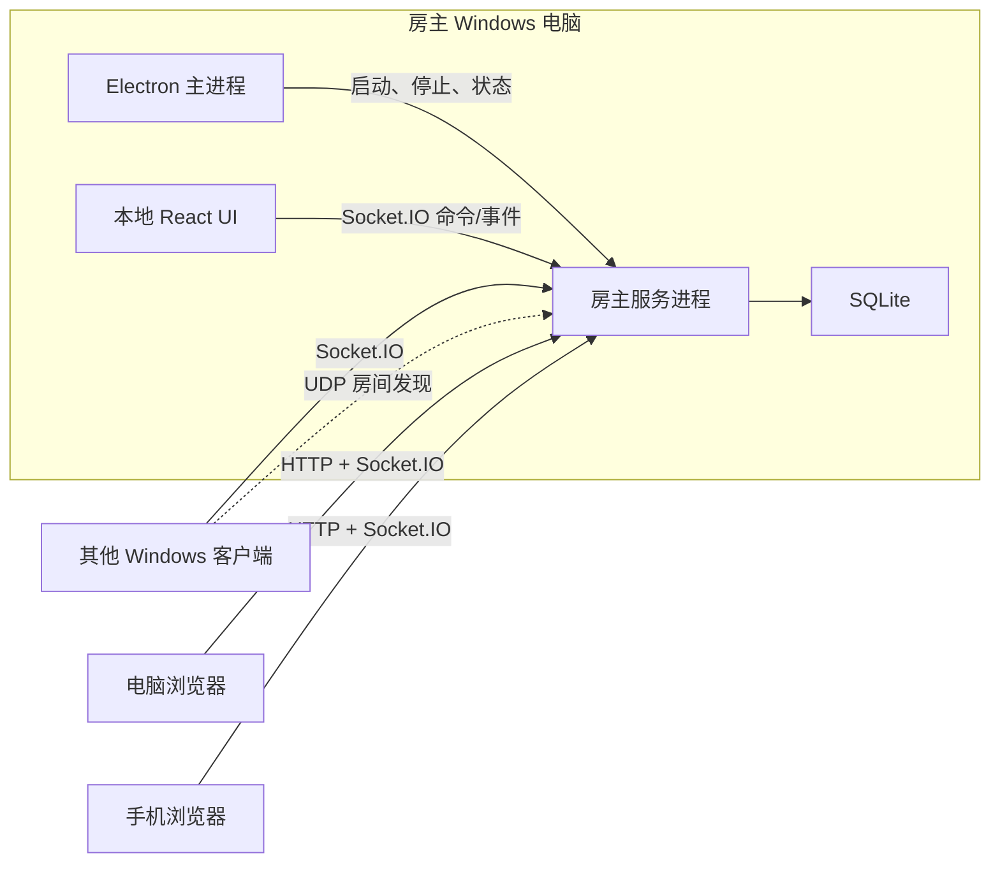

# Texas Hold'em 项目架构

> 状态：开发基线  
> 适用范围：`LeonemZhang/Texas_Holdem`  
> 产品规则以 `docs/product-spec.md` 为准。本文定义系统边界、技术决策、模块职责和后续实施约束。

## 1. 架构目标

- 无公网基础设施也能完成多人联机。
- 房主电脑是唯一权威服务端。
- Windows 客户端和网页端复用同一套 React 游戏界面。
- 手机浏览器是一等参与端，不是只读或降级端。
- 游戏核心保持确定性、无界面依赖并可独立测试。
- 网络重试不会导致重复下注、重复转账或重复结算。
- 意外断线不会删除房间和玩家状态。
- 代码边界适合按最小模块逐步实现和验证。

## 2. 核心架构决策

### 2.1 权威房主服务器

系统采用客户端/服务器架构，不采用点对点同步：

- 房主 Windows 客户端启动本地房间服务器。
- 所有发牌、洗牌、行动计时、下注校验、底池构造、牌型比较和结算均在服务端执行。
- 客户端只提交命令并显示服务端确认后的状态。
- 房主 UI 也只是一个客户端，不能绕过服务端直接改写游戏状态。

本项目接受“房主电脑本身受信任”这一边界，不实现对恶意房主的密码学防作弊。

### 2.2 共用 Web UI

Windows 客户端和浏览器使用同一套 React 应用：

- Electron 加载打包在应用内的前端资源。
- 房主服务器同时向浏览器提供同一版本的前端静态资源。
- 桌面端与浏览器端的图标由单一 SVG 母版生成；构建前检查 ICO、favicon、Web App 和系统磁贴派生资源，防止品牌漂移或回退为 Electron 默认资源。
- 前端通过运行时适配器判断是否拥有桌面能力。
- 只有桌面适配器可以创建房间、扫描局域网和显示原生关闭确认。
- 游戏组件和状态管理不感知 Electron API。

### 2.3 桌面安全边界

- Electron 渲染进程启用沙箱和上下文隔离。
- 禁止在渲染进程启用 Node.js 集成。
- 只通过窄化、参数校验后的 preload API 暴露桌面能力。
- Electron 不加载房主或其他玩家提供的远程 HTML；桌面端始终加载本地打包 UI。
- 网络消息作为不可信输入进行协议校验。

### 2.4 本地优先持久化

- 正在运行的房间状态以内存中的权威状态为准。
- 接受的命令产生顺序事件，并持久化到房主本机 SQLite。
- 在关键状态转换和每手结算后保存快照。
- 每个房间都是独立的对局记录，并保存最近一次联机网卡名称和公布 IPv4；桌面端启动后显示大厅、不自动将“最近一局”恢复到运行时。仅当检测到本机仍在运行的房主服务时，大厅才在加入表单上方展示其`进行中`记录的恢复入口，并重新取得该房间的房主会话。
- 恢复时仅在保存的 IPv4 仍属于本机网卡时自动复用；否则要求房主选择网卡，成功恢复后覆盖记录的网卡信息。迁移前的记录允许没有网卡信息。
- 网卡选择只存在于当前创建或恢复操作的渲染状态；桌面主进程不得把未创建房间的选择保存为全局宿主配置。旧记录和失效地址由渲染进程先展示选择控件，再调用恢复 IPC，避免以 IPC 拒绝作为正常交互分支。
- Electron 主进程在 ready 前将 `userData` 和 Chromium `sessionData` 强制设置为操作系统 `appData/Texas Holdem`，房主 SQLite 固定使用其下的 `rooms` 子目录；不接受外部启动参数把运行数据重定向到桌面。
- 项目不依赖云数据库或公网同步。

## 3. 技术栈

| 层             | 选择                | 说明                                               |
| -------------- | ------------------- | -------------------------------------------------- |
| 语言           | TypeScript 严格模式 | 前后端共享协议类型，减少多语言边界                 |
| 工作区         | pnpm workspace      | 管理应用与共享包                                   |
| 桌面端         | Electron            | 提供 Windows 窗口、UDP、原生退出确认和服务进程管理 |
| 前端           | React + Vite        | 同一构建产物服务桌面端和浏览器端                   |
| 房主 HTTP 服务 | Fastify             | 提供静态资源、健康检查、加入握手和必要的 REST 接口 |
| 实时通信       | Socket.IO           | 提供有序消息、确认、重连和房间广播能力             |
| 协议校验       | Zod                 | 在客户端、IPC 和服务端边界执行运行时校验           |
| 数据库         | SQLite              | 保存房间、快照、事件、玩家和统计数据               |
| 单元/集成测试  | Vitest              | 测试纯规则模块和服务端模块                         |
| 端到端测试     | Playwright          | 验证多浏览器玩家、响应式界面和重连流程             |

具体依赖版本在创建工程骨架时锁定，不在架构文档中使用浮动的 `latest`。

## 4. 运行时拓扑



### 4.1 Electron 主进程

负责：

- 创建和管理窗口。
- 主窗口在本地渲染器就绪后先最大化到当前显示器工作区再显示；还原或最大化失败时以 1920×1080 为目标，并按启动显示器工作区裁剪安全回退尺寸。该尺寸不构成运行时分辨率阻止。
- 提供受限的桌面 IPC。
- 枚举网络适配器。
- 发送 UDP 房间发现请求。
- 创建房间时启动独立房主服务进程。
- 执行原生关闭确认和正常退出流程。
- 仅通过受限 preload 通道复制邀请码二维码 PNG；浏览器优先使用 Clipboard API，桌面端不得向渲染进程暴露通用剪贴板能力。
- 通过窄化 IPC 提供本机对局记录的列出、创建、恢复、归档、删除和查看入口；不向渲染进程暴露 SQLite、服务进程句柄或通用 IPC。
- 对局记录管理使用仅本机 IPC 的宿主进程模式：它打开持久化和管理端口，但不监听 HTTP、不启动 Socket.IO 或 UDP 发现，也不公布局域网地址。
- 主窗口只保留受信任的本地渲染器地址；外部 HTTP(S) 链接交给系统浏览器打开，所有新窗口请求一律拒绝。
- 默认隐藏应用菜单，避免将开发者工具或未受限的原生入口暴露给普通玩家。
- 在创建窗口前设置稳定的产品名和 Windows AppUserModelID；打包配置显式固定可执行文件、快捷方式及卸载项身份，原生窗口从 `extraResource` 的真实文件路径加载品牌图标。

主进程不实现德州扑克规则。

### 4.2 房主服务进程

房主服务以独立 Node.js 进程运行，避免 UI 或渲染进程异常直接污染游戏状态。

负责：

- HTTP 服务和浏览器静态资源。
- Socket.IO 连接与身份恢复。
- UDP 房间发现响应。
- 房间、牌局和筹码转移命令处理。
- 游戏状态机和服务端计时。
- SQLite 持久化。
- 面向不同玩家过滤私有信息。
- 提供仅供 Electron 主进程调用的对局记录管理端口；该端口不经 LAN HTTP 或 Socket.IO 暴露给玩家。
- 管理模式不创建网络服务；只有创建或恢复实际房间时才以选定或已保存的网卡启动完整宿主服务。
- 启动成功后向 Electron 主进程发送带实例标识的就绪信号；由桌面端启动的服务持续检测父进程，父进程消失时执行异常关闭，不能伪造正常 `CLOSED` 事件。

### 4.3 React 客户端

负责：

- 显示服务端状态快照和事件结果。
- 根据服务端提供的合法行动渲染操作按钮。
- 收集玩家意图并提交命令。
- 展示连接、掉线和恢复状态。
- 适配桌面及最低 360px 宽度的手机界面；共享状态、命令和叶子组件，桌面与紧凑宽度分别组织页面区域。
- 牌桌页面将顶部状态、中间牌桌工作区和底部操作区作为互不侵入的布局区域；工具面板由房间页面统一仲裁，同一时间只展示房主管理、筹码交换或统计中的一个。三个工具面板共用吸顶头部、标签栏规则和单一“收起”动作；桌面使用右侧抽屉，移动端使用全屏面板并隔离下注区和加注弹层，关闭后恢复加注草稿。
- 手机高度使用动态视口和安全区约束，长结算、准备和工具内容在自身区域滚动，不依赖设备标称物理分辨率。结算折叠状态由展示组件内部管理：结算卡片自己的标题行使用独立描边胶囊按钮收起详情，不复用工具抽屉头部，新 `handId` 自动展开；桌面和手机端折叠入口均锚定在牌桌进度文字正下方。结算准备框顶部将就绪、主动摊牌和暂不参与组织为可换行操作组；主动摊牌只消费既有服务端资格与命令，结算玩家筹码直接渲染当前权威快照值。
- 房间等待页按权威 `seatIndex` 和当前 `maxPlayers` 投影对应数量的物理座位：桌面优先使用两列并按行填充，奇数人数的最后一个座位落在左列底部，移动端只显示实际玩家。仅房主可在连续座位的 `lobby` 阶段将玩家卡片拖到另一张玩家卡片上，触发一次 `room.reseat-player` 原子交换。空座位不接收拖放；若快照存在座位空洞，客户端只提供 `room.shuffle-seats` 对应的“随机打乱”以恢复紧凑排列。服务端亦拒绝非紧凑或指向空座位的换座命令；客户端随后等待权威快照更新，不做乐观排序。
- 手机座位队列的视觉顺序与桌面座位坐标分离：桌面位置始终按固定座次计算，手机队列始终投影房间快照中的全部玩家，并以 `handId + street` 作为轮次边界按服务端行动顺位重排；同一轮只随当前行动者调整横向滚动，不改变节点顺序。滚动目标受自然最大滚动距离约束，右侧剩余玩家可完整显示时保留左侧已行动玩家，不使用队尾空白强制行动者贴左。本人摘要始终属于移动端视觉层且不可交互，但直接复用真实座位卡的内容投影，确保顺位、位置、行动、筹码、状态、结算和本轮下注与其他玩家一致；真实本人座位继续固定在牌桌下沿。移动行动者把行动状态和顺位合并为唯一标签，避免重复标识相交。
- 加注控件在客户端内部维护受服务端合法范围约束的草稿金额；移动端调整入口只控制弹层，确认入口才产生 `game.raise-to` 意图。快捷筹码的视觉圆盘与 44px 触控区分层。桌面滑块、范围说明和三项下注统计使用共享的 17rem 轨道宽度并靠近右侧筹码区；跟注文字和金额徽标作为不可换行的单一按钮内容。
- 正常对局的牌面展示采用流式中央网格：状态与独立倒计时、公共牌、底池纵列、本人底牌分别占行，后三者相对桌布水平居中；状态保留完整 DOM 文本并在可用宽度内单行省略。结算详情保持标签列样式，通过共享标签列宽度对齐公共牌、玩家底牌和最佳五张牌的实际卡牌左边界。
- 桌面牌桌采用约 16:9、最大 80rem 的宽桌布和十人局专属座位密度，底部操作区仍限制为 72rem；原生 1920×1080、Windows 100% 缩放的普通最大化窗口必须无需纵向滚动即可看到牌桌和操作区。低高度还原窗口继续通过按高度收缩桌布和纵向滚动尽力保留操作能力，但不属于桌面支持基准。
- 只从相邻的权威快照推导界面音效；首次快照、重复快照和回放快照不得重播历史操作。结算音效按当前玩家的 `netChanges` 选择赢、输或持平；行动读秒只消费当前玩家的 `actionDeadlineMs`，固定从“滴”起始到下一次“滴”起始的 2 秒节拍，并在行动者变化、行动完成、截止或组件销毁时清理调度。

客户端不自行判定赢家、底池或各街下注历史，也不自行推进牌局阶段；这些展示数据均来自服务端权威快照。

## 5. 建议仓库结构

逻辑模块不等于独立 npm 包。只有跨运行时复用或具备明确部署边界时才创建 workspace 包，避免过度拆包。

```text
Texas_Holdem/
├─ apps/
│  ├─ client/                 # 共用 React 客户端
│  ├─ desktop/                # Electron 主进程与 preload
│  └─ host/                   # 房主 HTTP、Socket.IO 与进程入口
├─ packages/
│  ├─ poker-core/             # 纯德州扑克规则与状态机
│  ├─ protocol/               # 命令、事件、快照和 IPC schema
│  ├─ lan-discovery/          # Node/Electron UDP 发现协议
│  ├─ ui/                     # 可复用响应式 UI 组件
│  └─ test-support/           # 牌组、玩家和对局测试构造器
├─ docs/
│  ├─ product-spec.md
│  └─ architecture.md
├─ package.json
├─ pnpm-workspace.yaml
└─ tsconfig.base.json
```

## 6. 最小逻辑模块边界

后续详细实施计划应以这里的逻辑模块为拆分上限，并在需要时进一步细分。

### 6.1 `poker-core`

`poker-core` 是无网络、无数据库、无系统时间读取的纯 TypeScript 包。

内部逻辑模块按依赖顺序为：

1. **牌与牌组**：点数、花色、牌编码、52 张唯一牌和洗牌输入输出。
2. **五张牌比较**：牌型分类及同牌型比较键。
3. **七张牌比较**：枚举 21 种五张组合并选择最大结果。
4. **座位与位置**：有效座位、庄家、大小盲及双人特殊规则。
5. **下注轮状态**：当前下注、跟注额、最小加注和行动资格。
6. **底池构造**：主池、边池、贡献额和获奖资格；单独贡献层标记为未匹配并退回原贡献者。
7. **底池分配**：赢家、平分、奇数筹码和未匹配贡献退回；每层及全局都校验筹码守恒。
8. **单手状态机**：翻牌前、翻牌、转牌、河牌和结算阶段推进。
9. **连续牌局状态**：庄家轮转、完成手数、盲注增长和按权威座位稳定创建手牌玩家列表。

每个模块只能依赖其前置模块，不允许反向依赖 UI、协议、Socket.IO 或 SQLite。

### 6.2 房间领域模块

房间领域位于 `apps/host` 的独立目录中，负责游戏核心之外的多人房间规则：

1. 房间设置与验证。
2. 加入、座位、房主大厅换座和身份令牌。
3. 第一手前的房间准备。
4. 每手前的 30 秒手牌准备。
5. 指定玩家筹码请求、给予、批准、拒绝、撤销和房间级公开历史。
6. 主动退出、房主分阶段移出、意外掉线和重连。
7. 房主暂停、继续和关闭房间。
8. 统计事件归约和局内称号。

房间领域通过明确接口调用 `poker-core`，不能直接修改其内部状态。

### 6.3 协议模块

`packages/protocol` 定义：

- 客户端命令。
- 服务端事件。
- 玩家可见快照。
- 房间发现报文。
- Electron IPC 请求与响应。
- 协议版本和兼容性规则。

协议 schema 是运行时边界。TypeScript 类型必须从 schema 推导，不能另外维护一份可能漂移的手写类型。

当前线协议版本为 `3`。`room.reseat-player` 和 `room.shuffle-seats` 只接受房主在大厅阶段提交；前者只在紧凑座位中原子交换两名已入座玩家，后者由服务端随机源生成座位 1 至 N 的紧凑排列。筹码请求只接受具体 `targetPlayerId`。`PlayerSnapshot.chipActivity` 是包含服务端权威毫秒时间戳的完整公开历史，`chipRequests` 仅保留当前可操作请求。协议 v1、v2 和缺少筹码历史时间戳的旧恢复快照不兼容。

### 6.4 客户端模块

客户端按交互职责拆分：

1. 连接与重连。
2. 联机大厅。
3. 创建房间。
4. 房间等待和首局准备。
5. 牌桌展示。
6. 玩家行动控件。
7. 手牌准备与筹码交换。
8. 统计与对局结算。
9. 房主控制。
10. 桌面能力适配器与浏览器能力适配器。

每个功能先完成窄屏与桌面布局定义，再接入真实服务端数据。

## 7. 牌型比较算法

### 7.1 运行时实现

运行时使用可审计的确定性算法：

1. 从 7 张牌枚举全部 21 个五张牌组合。
2. 将每个五张组合转换为比较元组。
3. 按牌型等级和逐级踢脚牌比较元组。
4. 返回最大元组、牌型名称和组成最佳牌型的五张牌。

五张牌比较元组示例：

```text
同花顺 [8, 顺子最高点]
四条   [7, 四条点数, 踢脚牌]
葫芦   [6, 三条点数, 对子点数]
同花   [5, 第1高牌, 第2高牌, 第3高牌, 第4高牌, 第5高牌]
顺子   [4, 顺子最高点]
三条   [3, 三条点数, 第1踢脚, 第2踢脚]
两对   [2, 大对子, 小对子, 踢脚牌]
一对   [1, 对子点数, 第1踢脚, 第2踢脚, 第3踢脚]
高牌   [0, 第1高牌, 第2高牌, 第3高牌, 第4高牌, 第5高牌]
```

A2345 顺子的最高点按 5 处理。

### 7.2 成熟实现交叉验证

核心实现不依赖外部库完成运行时判定，但测试必须使用成熟 evaluator 作为独立参考，例如 PH Evaluator 或经过审查的 TypeScript 实现。

验证层次：

- 穷举全部 2,598,960 个五张牌组合并核对标准牌型数量。
- 使用固定种子生成大量七张牌，与参考 evaluator 比较强弱及平局结果。
- 为所有牌型、踢脚牌、公共牌成牌和 A2345 编写具名用例。
- 在引入或升级参考库时记录版本和许可证。

## 8. 游戏状态与命令模型

### 8.1 状态阶段

```text
LOBBY
PRE_HAND_READY
PREFLOP
FLOP
TURN
RIVER
SHOWDOWN
SETTLEMENT
PAUSED
CLOSED
```

`LOBBY` 中房主默认已准备；所有非房主玩家准备后只启用房主开始命令，不自动转换到 `PRE_HAND_READY` 或 `PREFLOP`。

第一手由房主开始命令直接创建手牌。后续每手必须先经过 `PRE_HAND_READY`。

准备截止时服务端将未确认玩家投影为 `sitting-out`，但不销毁仍处于 `PRE_HAND_READY` 的准备上下文或待处理筹码请求；不足两名就绪时不创建新手牌。后续沿用既有 `hand-ready.set-choice: ready` 命令接受筹码不少于当前有效大盲注的玩家重新就绪；待处理请求继续阻止状态机创建下一手。

### 8.2 命令

每个修改状态的客户端请求必须包含：

- `commandId`：客户端生成的唯一标识，用于幂等去重。
- `roomId`。
- `playerId` 和会话身份。
- `expectedVersion`：客户端认为的房间状态版本。
- 命令类型和通过 schema 校验的载荷。

示例命令：

- `SetLobbyReady`
- `StartFirstHand`
- `Fold`
- `Check`
- `Call`
- `RaiseTo`
- `AllIn`
- `RequestChips`
- `GrantChips`
- `ApproveChipRequest`
- `SetPreHandReady`
- `ShowHoleCards`
- `LeaveRoom`
- `CloseRoom`
- `UpdateRoomSettings`（仅首局开始前的房主大厅会话）

### 8.3 事件与快照

- 服务端接受命令后产生一个或多个顺序事件。
- 每个事件包含单调递增的 `sequence`。
- 每次状态变化增加 `stateVersion`。
- 客户端不能依赖 Socket.IO 默认重试来保证业务幂等。
- 短时重连优先补发缺失事件。
- 无法连续补发时发送该玩家专属的完整快照。
- 快照必须过滤其他玩家底牌、牌组顺序和未公开信息；牌桌展示所需的总池、各街投入、结算净变化、当前玩家牌型和最佳五张牌均由服务端投影。`room.smallBlind`/`room.bigBlind` 表示当前手或下一手实际生效级别，`room.settings` 保留房间基准配置；手牌准备资格、下一手创建和状态行显示必须共用该有效级别。每个玩家的 `actionOrder` 只投影当前仍可行动者，客户端从本人权威座位按顺时针排列展示。仅在服务端确认的摊牌结算后，可向所有玩家公开仍有资格竞争底池者的两张底牌。因弃牌提前结束时，快照保留已公开的公共牌但不补发后续牌；若无人可继续行动，服务端补齐公共牌至河牌后再结算。结算到下一手开始的窗口内，玩家只能通过服务端校验的“主动摊牌”命令公开本人的两张底牌；该公开结果写入公共结算快照、不可撤销，不改变结算；弃牌获胜时只有主动摊牌的赢家牌型进入牌型记录。
- 大厅快照包含当前完整房间配置，供房主编辑表单回填；更新配置只能由服务端接受首局开始前的房主命令完成。人数上限不能低于当前玩家数，初始筹码更新会同步大厅玩家余额但不改变准备状态。

## 9. 局域网发现

### 9.1 默认端口

- HTTP 与 Socket.IO：`32100/TCP`。
- 房间发现：`32101/UDP`。
- 端口允许在后续配置中覆盖，但协议报文必须携带实际端口。

### 9.2 发现流程

1. Windows 客户端枚举实体和虚拟 IPv4 网卡。
2. 点击刷新后向候选网卡的广播地址发送带协议版本的发现请求。
3. 房主以单播响应房间摘要和连接地址。
4. 客户端以 UDP 响应的实际源 IPv4 覆盖不匹配的宣传地址，确保多网卡房主返回可达 TCP 目标。
5. 客户端合并重复响应，并按最后响应时间移除过期房间。
6. 客户端使用 TCP 健康检查验证房间确实可连接。

房主服务监听 `0.0.0.0`，房间发现响应可以公布房主选择的网卡地址，但扫描器优先使用实际回复该广播的源 IPv4 作为连接目标，例如同一主机同时拥有虚拟网卡和实体网卡时，玩家使用本地网络能够到达的接口。

广播发现是便利功能，手动 IP 直连是必须始终可用的兜底能力。

## 10. 身份与信息隔离

- 玩家首次加入后获得不可猜测的重连令牌。
- 服务端根据令牌恢复 `playerId` 和座位，不能使用昵称作为身份凭证。
- 昵称在同一房间的玩家身份记录中唯一，但只用于显示；大厅退出的历史身份不构成新的加入身份，恢复必须使用原令牌。大厅阶段的 `left` 恢复请求可以在同一次房间状态提交中更新昵称；局内恢复不能改名。
- 主动退出后，原设备保存的令牌可恢复同一 `playerId`、座位、筹码和统计；恢复令牌按 `roomId` 隔离，因此同一设备可保留多个房间的独立恢复资格。
- 主动退出统一使用可恢复的 `left` 状态；当前手中的 `left` 玩家由服务端按常规超时动作推进，恢复后在本手使用 `sitting-out` 状态且不能提交下注命令。
- 房主移出统一使用终止状态 `removed`，权威快照保留座位与历史，但桌面牌桌投影过滤该状态；会话认证、命令授权和恢复接口必须拒绝该身份。
- 可选房间密码只用于限制加入，不代替重连令牌。
- 服务端为每名玩家生成独立快照，不能把全量状态广播后让客户端自行隐藏底牌。
- 房主 UI 和普通玩家 UI 接收相同级别的牌面隔离；房主只能通过受信任的服务进程控制房间，不能从 UI 查看牌组。

## 11. 持久化模型

建议持久化以下概念实体：

- `rooms`：一条房间即一条对局记录，保存房间设置、房主、创建/最后活动时间、正常关闭标记与记录生命周期状态。
- `players`：稳定身份、昵称、座位、筹码和连接状态；数据库允许离场历史身份与当前玩家保留相同座位号，当前有效玩家的座位唯一性和原子交换由房间领域状态保证，避免逐行保存交换时产生瞬时唯一索引冲突。
- `events`：房间内按 sequence 排序的领域事件。
- `snapshots`：可恢复的房间状态和对应 sequence。
- `hand_summaries`：每手参与者、公共牌、底池、结果及服务端评估的最佳五张牌型摘要。
- `chip_transfers`：请求、批准、拒绝、撤销和最终转移。
- `statistics`：可由事件重建的缓存统计结果。

持久化规则：

- 先保证事件和状态变更的一致性，再向客户端确认成功。
- 筹码转移必须在单个数据库事务中完成。请求创建仅在手牌准备阶段；请求决策可跨阶段执行，对局中只调整未投入 stack 并由服务端重新投影合法操作。
- 完整筹码活动随房间恢复快照保存，按权威 sequence 更新，并为请求创建、最近状态变化及主动给予完成保存服务端毫秒时间戳；请求批准只终结原请求记录，主动给予形成独立完成记录。客户端只负责将最近更新时间格式化为本地 `HH:mm:ss`。
- 正常关闭房间记录 `CLOSED` 事件和最终快照；房主客户端收到该快照后停止并等待宿主子进程退出，释放监听端口。随后清理该房间的内存运行时、计时器和会话上下文；下一局由新宿主服务在创建表单中选择网卡后启动。
- 房主异常退出不写入正常关闭事件，并使该记录在下次启动时列为“异常中断可恢复”。
- 房主选择异常中断记录恢复时才将该记录载入运行时；选择`进行中`记录恢复时仅为同一运行时重新签发房主会话。恢复优先按记录中仍可用的 IPv4 启动服务，缺失或失效时才要求选择网卡；成功后持久化新网卡。任一创建或恢复请求都必须先检查当前运行记录：同一记录可回到房间，其他记录一律拒绝，且不覆盖任何可恢复记录。若房主在有运行记录时创建新房间，桌面端先要求选择恢复旧局或正常关闭旧局后继续创建；后者必须发布最终快照、停止宿主服务并等待端口释放，保留表单后让房主在创建时重新选择网卡。归档是可逆的目录状态变更，不删除事件、快照、玩家或统计。只有已归档记录能在桌面端经二次确认后物理删除，删除 `rooms` 主记录并通过外键级联移除其关联数据。
- 同一宿主服务一次只能载入一条运行中的记录；服务端保留该约束，记录目录及生命周期操作仅通过 Electron 主进程的受限通道访问。
- 可从原始事件重新计算统计，统计缓存不是唯一事实来源。净输赢只归约已确认手牌结算的 `netChanges`，不读取 `chip_transfers` 或房间当前筹码，以隔离筹码交换的影响。
- 本机记录管理通过受限 Electron IPC 请求权威统计；运行中记录从内存运行时投影，其余记录从快照、手牌摘要和统计事实重建。牌型比较只在 poker-core/host 完成，renderer 仅渲染已投影的类别、归属和牌面；牌型记录归约接受摊牌结算的评估结果，或弃牌获胜时结算阶段主动摊牌赢家的评估结果，未主动摊牌的未摊牌获胜牌型不进入全局或个人最大牌型。

## 12. 时间与随机数

- 服务端使用单调时间计算行动和准备阶段截止时间。
- 对外事件携带绝对截止时间，客户端结合服务端时间差展示倒计时。
- 所有超时决定由服务端作出。
- 洗牌使用系统密码学安全随机源执行 Fisher-Yates 洗牌。
- 测试通过注入的确定性随机源和虚拟时钟复现牌局。
- 游戏核心禁止直接调用全局系统时间或全局随机函数。

## 13. 测试策略

### 13.1 纯规则单元测试

- 牌唯一性与牌组完整性。
- 五张及七张牌比较。
- 双人、三人和多人座位顺序。
- 最小加注、全押和再次加注资格。
- 主池、多个边池、平分和奇数筹码。
- 各街状态推进和手牌结束条件。
- 盲注按完成手数增长。

### 13.2 领域不变量

- 除初始化外，房间筹码总量保持不变。
- 一手中不会出现重复牌。
- 玩家累计投入等于全部底池金额。
- 每个底池分配层的赢家派彩或未匹配贡献退回之和等于该层金额，全部层级的结果等于底池总额。
- 只有仍有获奖资格的玩家可以获得对应底池。
- 同一个 `commandId` 最多生效一次。
- 任何时刻最多只有一名需要主动操作的玩家。

### 13.3 服务集成测试

- 创建、加入、准备和房主手动开始首局。
- 房主在大厅移动到空位、交换占用座位以及随机生成紧凑且不同的座次。
- 每手准备倒计时及全员提前就绪。
- 筹码请求和原子转移。
- 掉线、超时、重连和快照恢复。
- 房主正常关闭与异常退出恢复。
- 不同玩家收到不同的私有快照。

### 13.4 端到端测试

- 一个房主加多个浏览器玩家完成整手牌。
- UDP 发现失败后使用 IP 直连。
- 手机宽度下完成全部行动和筹码请求。
- 1920×1080 下验证固定两列五行大厅座位表，360×640 和 393×852 下验证实际玩家单列滚动列表。
- 刷新网页后恢复原座位和状态。
- 版本不兼容时阻止加入并显示明确提示。

响应式基准至少覆盖 360×800、393×852、402×874、412×915、427×952、430×932、440×956、448×997，以及浏览器工具栏展开后的 360×640、390×667、393×700、412×732、440×760 可用视口。桌面最低支持基准为原生 1920×1080 显示器、Windows 100% 显示缩放和普通最大化窗口，同时验证接近实际最大化工作区的 1920×1000 内容视口；更低分辨率、低高度还原窗口和更高显示缩放只作尽力兼容，不作为桌面验收失败。桌面端不增加运行时分辨率检测、警告或阻止流程。

## 14. 后续 GPT-5.6 Luna 实施计划契约

后续详细计划不是重新选择架构，而是把本文确定的模块转化为可顺序执行的最小任务。

每个任务必须包含：

1. 唯一的模块目标。
2. 明确的前置依赖。
3. 允许修改和新增的文件范围。
4. 输入、输出和公共接口。
5. 必须保持的不变量。
6. 具体实现要求。
7. 单元或集成测试。
8. 可直接运行的验证命令。
9. 完成判定和明确的非目标。

拆分原则：

- 一个任务只负责一个可测试行为或一个薄集成层。
- 纯算法先于状态机，状态机先于协议，协议先于网络接入。
- 服务端行为完成后再接入对应 UI；不得在同一任务中首次设计协议并完成两端全部界面。
- 持久化先定义端口接口，再实现 SQLite 适配器。
- 外部依赖必须封装在适配层，领域模块不能直接导入 Electron、Socket.IO、Fastify 或 SQLite。
- 每个任务通过验证后才继续下一个依赖任务。
- 不使用“完成剩余功能”“实现整个牌桌”之类不可验收的大任务描述。

推荐的高层依赖顺序为：

```text
工程骨架
-> 牌与牌型算法
-> 座位、下注、底池和单手状态机
-> 房间设置、准备和筹码转移
-> 协议 schema
-> 房主内存服务
-> SQLite 持久化与恢复
-> Socket.IO 接入
-> UDP 发现与 IP 直连
-> 共用客户端页面
-> Electron 生命周期与打包
-> 多端端到端验收
```

这只是依赖方向。正式 Luna 计划仍需将每一项继续拆成最小模块，不允许把上述任意一整行直接当作单个实施任务。
